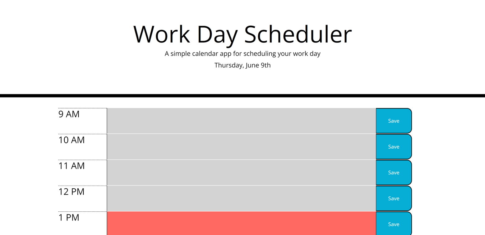
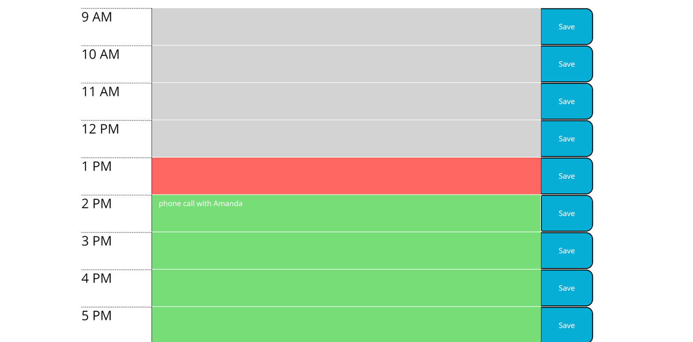

# workDayByDay
## Starting the Scheduler
The current time of day is stored into a variable to be updated every second. The current day is also formatted and displayed at the top of the page. The program then checks to see if an hour array is already stored in local storage. If the local storage does not include the array of hour objects, one is created and stored in local storage (see "Creating the Hour Object Array" sub-section below). Using the array of hour objects from local storage, a row element is then created and populated for each hour of the day (see "Creating and Filling Row Element" sub-section below).

### Creating and Filling Row Elements
For each hour object stored in the array in local storage, a row element, a time heading element, a text area, and a save button are created. The time heading element is filled with the value of the hour object's hour number and time of day fields. For example, for the hour of 1 o'clock in the afternoon, the time heading element would be filled with "1 PM". The text area is then filled with the object's string of scheduled events. The current time is checked against the hour object's start and end times to determine the class of the text area (see "Row Colors" section below).. The save button is then created. The time heading, text area, and save button are then appended to the row element and added to the page. The row element is then added to an array. 

### Creating the Hour Object Array
For each hour of the work day, an hour object is created. These objects include the hour number in terms of a 12-hour clock display, the time of day (AM or PM), a blank string to be filled with the scheduled events for the hour, the hour's starting time, and the hour's end time. For example, for the hour of 1 o'clock in the afternoon, "1" would be stored as the hour number, "PM" would be stored as the time of day, a blank string would be set as the scheduled events, the starting time would be set as a moment representing the time "13:00:00", and the end time would be set as moment representing the end of the hour "13:59:59". An object would be created for each hour of the work day (9AM to 5PM). Each object would then be added to an array of objects which would then be saved to local storage.

## Telling Time
When the scheduler is first loaded, a variable containing the current time is created. An interval is then set to update the current time every 1000 milliseconds, or one second. The current value of minutes is also checked on this interval. If the value of minutes is equal to zero, it is the top of a new hour and the page is refreshed to update the classes of the objects to reflect the change in time. The interval also checks to see if the current moment is the start of a new day. If it is the start of a new day, the local storage is cleared and the newDay function is called to render the page with the newly emptied contents of local storage.

## Saving Scheduled Events
When the save button is clicked, the array of hour objects is loaded from local storage, parsed, and saved into a variable. The hour object's string of scheduled events is then updated to match the text inside the same row's text area. The updated array is then saved back into local storage.

## Row Colors
Upon creating the row elements for each hour object in the array, the current time is then checked against the start and end times of the hour object to determine which class should be set for the row's elements. If the current time is after the end time of the hour object, the hour has already passed and the class of the text area is set to "past" which changes the background color of the element to gray. If the current time is after the hour object's start time but before the hour object's end time, the hour object represents the current hour and the class of the text area is set to "present" which changes the background color of the object to red. If the current time is before the hour object's start time, the hour represented by the hour object has not started yet and class of the text area is set to "future" which changes the background color of the element to green.

